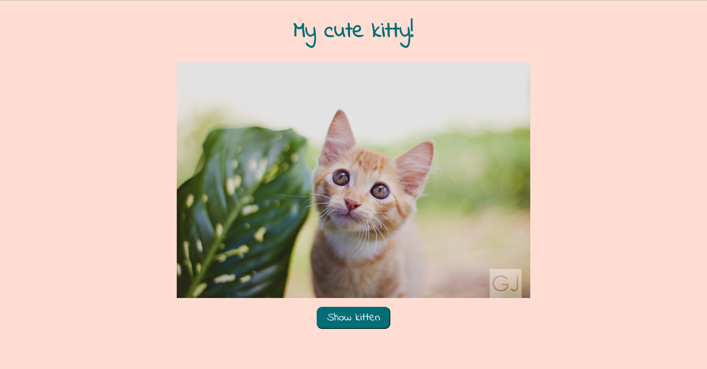

<h2>The Cat API</h2>
 

 API query exercise developed during Senai's DEVinHouse course. A random cat image is shown every time the page is refreshed or the button is pressed. 

 

<ul align="center">
<li align="center">HTML</li>
<li align="center">CSS</li>
<li align="center">JS</li>
</ul>
 
 

 
 
